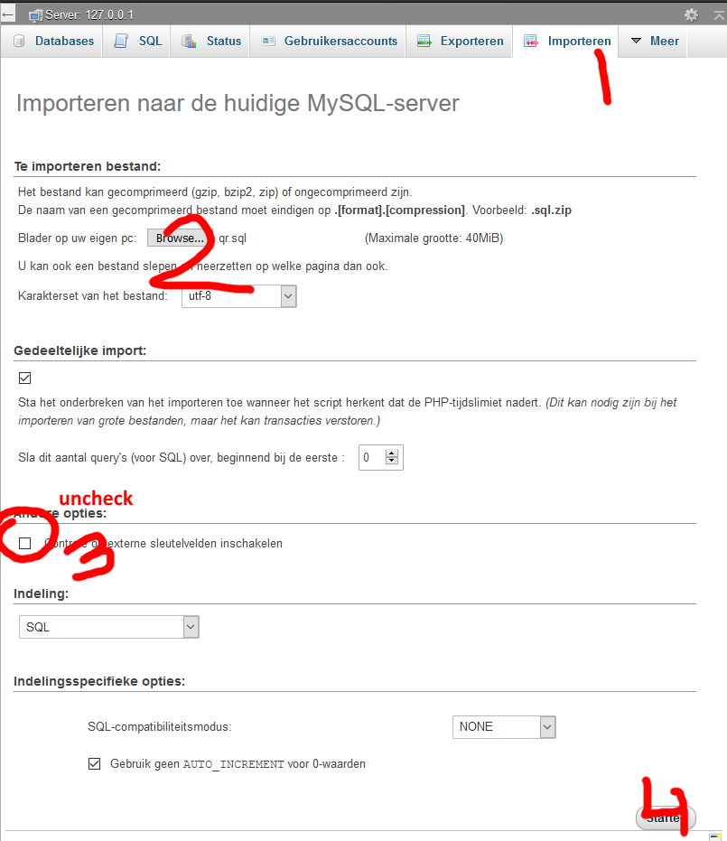

# Curio QR

An application where an administrator can insert instructions and generate a QR-code that links to those instructions. A user can later scan the QR-code and immediately open relevant information.

## Installation

1. Copy `backend/credentials.example.php` to `backend/credentials.php` and fill in your database details
2. Import the `qr.sql` file into your database and make sure you **uncheck** 'Enable foreign key checks'

